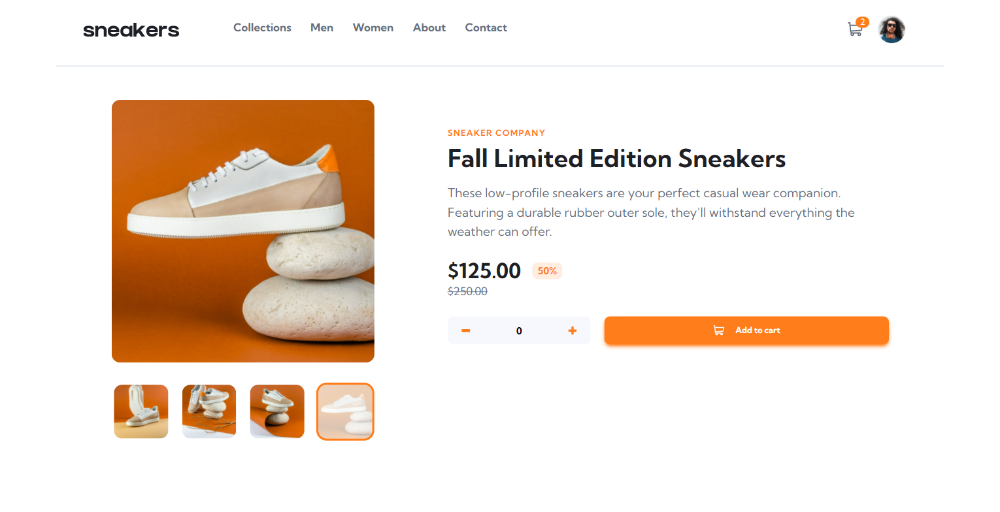

# Frontend Mentor - E-commerce product page solution

This is a solution to the [E-commerce product page challenge on Frontend Mentor](https://www.frontendmentor.io/challenges/ecommerce-product-page-UPsZ9MJp6). Frontend Mentor challenges help you improve your coding skills by building realistic projects.

## Table of contents

-   [Overview](#overview)
    -   [The challenge](#the-challenge)
    -   [Screenshot](#screenshot)
    -   [Links](#links)
-   [My process](#my-process)
    -   [Built with](#built-with)
    -   [What I learned](#what-i-learned)

## Overview

### The challenge

Users should be able to:

-   View the optimal layout for the site depending on their device's screen size
-   See hover states for all interactive elements on the page
-   Open a lightbox gallery by clicking on the large product image
-   Switch the large product image by clicking on the small thumbnail images
-   Add items to the cart
-   View the cart and remove items from it

### Screenshot



### Links

-   Solution URL: [repository](https://github.com/Bravonoid/ecommerce-product-page)
-   Live Site URL: [e-commerce-product-page](https://ecommerce-product-page-bravonoid.vercel.app/)

## My process

### Built with

-   Semantic HTML5 markup
-   Flexbox
-   [Tailwind CSS](https://tailwindcss.com/) - CSS Frameworks

### What I learned

Since this is my first project using TailwindCSS, it feels like i am writing CSS in a whole different universe, it's really a life changing. Even though, things didn't quite works well with what i want at first because i realized that TailwindCSS is using mobile-first workflow right after i finished designing my desktop version. Eventually, i managed to fix some things related to responsive design and finally finishing up.

Example implementation of TailwindCSS

```html
<button
	class="bg-white w-10 h-10 flex items-center justify-center pr-1 rounded-full absolute left-6 z-10 sm:hidden"
	id="previous-mobile"
>
	<svg
		width="12"
		height="18"
		xmlns="http://www.w3.org/2000/svg"
		id="previous-mobile"
	>
		<path
			d="M11 1 3 9l8 8"
			stroke="#1D2026"
			stroke-width="3"
			fill="none"
			fill-rule="evenodd"
			id="previous-mobile"
		/>
	</svg>
</button>
```

Local storage usage

```js
// Config localStrogae
if (localStorage["total"] == 0) {
	localStorage.setItem("total", amount.innerHTML);
} else {
	amountCart.innerHTML = items;
	if (amountCart.innerHTML >= 1) {
		amountCart.classList.replace("scale-0", "scale-1");
	}
}
```
